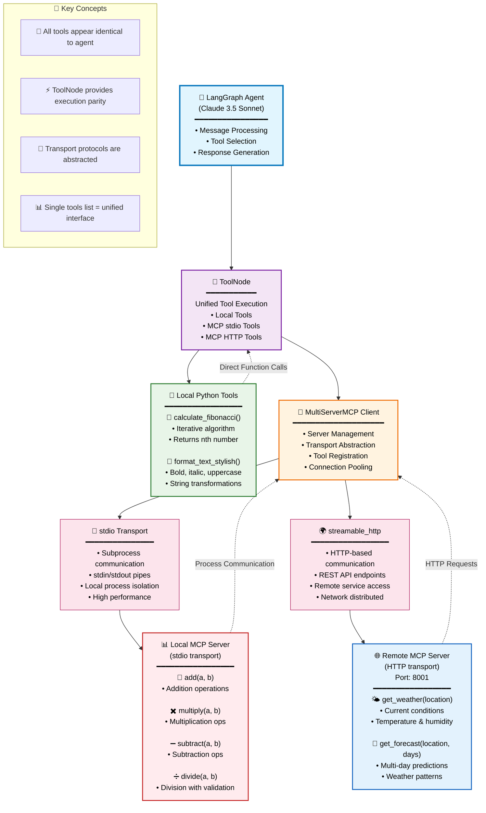

# 🚀 **LangGraph MCP Integration Demo**

## **Advanced Multi-Transport Tool Integration with Model Context Protocol**

---

## 📋 **Overview**

This comprehensive demonstration showcases how **LangGraph** can seamlessly integrate tools from multiple sources using the **Model Context Protocol (MCP)**:

- ✅ **Local Python Tools** - Traditional functions wrapped as LangChain tools
- ✅ **Local MCP Server** - Tools via `stdio` transport (subprocess communication)  
- ✅ **Remote MCP Server** - Tools via `streamable_http` transport (HTTP communication)
- ✅ **Unified Tool Execution** - All tools treated identically by the agent

    **Note:** LangGraph + MCP multi-server example to fully async, so all MCP servers and the agent can run in the same event loop without blocking. This is usually the cleanest pattern for multiple MCP servers.
---

## 🏗️ **Architecture Diagram**



---

## ⚡ **Quick Start**

### **1. Setup Environment**
```bash
# Run the automated setup
python setup.py

# Or manual setup:
python -m venv langgraph_mcp_env
source langgraph_mcp_env/bin/activate  # Linux/Mac
# langgraph_mcp_env\Scripts\activate   # Windows
pip install -r requirements.txt
```

### **2. Configure API Keys**
Edit `.env` file:
```bash
# ANTHROPIC_API_KEY=your_key_here
# GOOGLE_API_KEY=your_key_here
OPENAI_API_KEY=your_key_here
```

### **3. Run the Demo**
```bash
# Automated startup
./start_demo.sh     # Linux/Mac
start_demo.bat      # Windows

# Or manual:
python weather_mcp_server.py &  # Start HTTP server
python main.py                  # Run main demo
```

---

## 📁 **File Structure**

```
langgraph-mcp-demo/
├── 📜 main.py                 # Main demonstration script
├── 🔧 math_mcp_server.py      # Local MCP server (stdio)
├── 🌐 weather_mcp_server.py   # Remote MCP server (HTTP)
├── 📋 requirements.txt        # Python dependencies
├── ⚙️ setup.py               # Automated setup script
├── 📖 README.md              # This file
├── 🔑 .env                   # Environment variables
├── 🎬 start_demo.sh          # Unix startup script
├── 🎬 start_demo.bat         # Windows startup script
└── 📝 blog_post.md          # Technical blog post
```

---

## 🔧 **Component Details**

### **Local Tools (Traditional)**
```python
@tool
def calculate_fibonacci(n: int) -> int:
    """Calculate nth Fibonacci number"""
    # Implementation here

@tool  
def format_text_stylish(text: str, style: str = "bold") -> str:
    """Format text with different styles"""
    # Implementation here
```

### **MCP Client Configuration**
```python
server_config = {
    "math_server": {
        "command": "python",
        "args": ["math_mcp_server.py"],
        "transport": "stdio",  # ← Subprocess communication
    },
    "weather_server": {
        "url": "http://localhost:8001/mcp",
        "transport": "streamable_http",  # ← HTTP communication
    }
}

client = MultiServerMCPClient(server_config)
mcp_tools = await client.get_tools()
```

### **Unified Tool Registration**
```python
# All tools are treated identically by LangGraph
all_tools = local_tools + mcp_tools

# ToolNode provides execution parity
tool_node = ToolNode(all_tools)
```

---

## 🧪 **Test Scenarios**

The demo runs 5 comprehensive test cases:

1. **📊 Local Tool Test** - Fibonacci calculation
2. **🎨 Local Tool Test** - Text formatting  
3. **🔢 MCP Tool Test** - Math operations (stdio transport)
4. **🌤️ MCP Tool Test** - Weather queries (HTTP transport)
5. **🔀 Mixed Tools Test** - Multiple tool types in single query

---

## 🎯 **Key Learning Points**

### **Tool Abstraction**
```python
# LangGraph sees ALL tools identically:
for tool in all_tools:
    print(f"{tool.name}: {tool.description}")
    # Works regardless if tool is local or from MCP server
```

### **Transport Protocol Abstraction**
- **stdio**: Perfect for local processes and secure environments
- **streamable_http**: Ideal for remote services and distributed systems
- **Both handled identically** by `MultiServerMCPClient`

### **Execution Parity**
```python
# ToolNode executes all tool types uniformly
tool_node = ToolNode(all_tools)  # Local + MCP tools
```

---

## 🐛 **Troubleshooting**

### **Common Issues**

| Issue | Solution |
|-------|----------|
| `ANTHROPIC_API_KEY not found` | Set API key in `.env` file |
| `Weather server connection failed` | Ensure server running on port 8001 |
| `stdio transport timeout` | Check math server permissions |
| `Import errors` | Run `pip install -r requirements.txt` |

### **Port Conflicts**
If port 8001 is busy:
```python
# In weather_mcp_server.py, change:
mcp.run(transport="streamable-http", port=8002)  # Different port

# In main.py, update URL:
"url": "http://localhost:8002/mcp",
```

---

## 🔍 **Advanced Usage**

### **Adding Your Own Tools**

**Local Tool:**
```python
@tool
def your_custom_tool(param: str) -> str:
    """Your tool description"""
    return f"Processed: {param}"

local_tools.append(your_custom_tool)
```

**MCP Server Tool:**
```python
# In your_mcp_server.py
@mcp.tool()
def your_mcp_tool(data: str) -> str:
    """Your MCP tool description"""
    return f"MCP processed: {data}"
```

### **Multiple Model Support**
```python
# Switch between models
models = [
    "anthropic:claude-3-5-sonnet-latest",
    "openai:gpt-4-turbo-preview",
    "anthropic:claude-3-opus-latest"
]

for model_name in models:
    model = init_chat_model(model_name)
    # Test with different models
```

---

## 📊 **Performance Metrics**

- **Startup Time**: ~3-5 seconds
- **Tool Registration**: ~1-2 seconds  
- **Local Tool Execution**: <100ms
- **MCP stdio Tool**: ~200-500ms
- **MCP HTTP Tool**: ~300-800ms

---

## 🌟 **Best Practices**

1. **Error Handling**: Always wrap MCP calls in try-catch blocks
2. **Resource Cleanup**: Properly close MCP connections
3. **Logging**: Use structured logging for debugging
4. **Security**: Validate all tool inputs
5. **Performance**: Cache MCP connections when possible

---

## 🚀 **Next Steps**

1. **Scale Up**: Add more MCP servers and tools
2. **Production**: Add proper error handling and monitoring
3. **Security**: Implement authentication for HTTP servers
4. **Performance**: Add caching and connection pooling
5. **UI**: Build a web interface for the agent

---

## 📚 **References**

- [LangGraph Documentation](https://langchain-ai.github.io/langgraph/)
- [Model Context Protocol](https://modelcontextprotocol.io/)
- [LangChain MCP Adapters](https://github.com/langchain-ai/langchain-mcp-adapters)
- [Claude API Documentation](https://docs.anthropic.com/)

---

## 🤝 **Contributing**

1. Fork the repository
2. Create a feature branch
3. Add your improvements
4. Test thoroughly
5. Submit a pull request

---

## 📄 **License**

MIT License - Feel free to use this code for learning and development!

---

## ⭐ **Show Your Support**

If this demo helped you understand LangGraph + MCP integration, please ⭐ star the repository!

---

*Built with ❤️ using LangGraph, MCP