# 🚀 Building Unified AI Agents: How LangGraph + MCP Creates Seamless Tool Integration

*A comprehensive guide to integrating local tools and remote services using Model Context Protocol*

---

## The Challenge: Tool Fragmentation in AI Agents

As AI agents become more sophisticated, they need access to diverse tools and services. Traditionally, this has meant:

- 🔧 **Local tools**: Python functions tied to your codebase
- 🌐 **API integrations**: Custom HTTP clients for each service  
- 📦 **Third-party SDKs**: Different patterns for every provider
- 🔄 **Maintenance overhead**: Multiple integration patterns to manage

**What if there was a better way?**

---

## Enter the Model Context Protocol (MCP)

The [Model Context Protocol](https://modelcontextprotocol.io/) is revolutionizing how AI agents interact with tools and services. It provides:

- **🎯 Unified Interface**: Single pattern for all tool types
- **🔌 Multiple Transports**: stdio, HTTP, WebSocket support  
- **⚡ High Performance**: Optimized for AI agent workflows
- **🛡️ Type Safety**: Schema-driven tool definitions

Combined with **LangGraph**, MCP enables truly unified agent architectures.

---

## The Architecture: One Agent, Multiple Tool Sources

Here's what we're building:

```mermaid
graph TD
    %% Styling
    classDef agentClass fill:#e1f5fe,stroke:#0277bd,stroke-width:3px,color:#000
    classDef toolNodeClass fill:#f3e5f5,stroke:#7b1fa2,stroke-width:2px,color:#000
    classDef localToolClass fill:#e8f5e8,stroke:#2e7d32,stroke-width:2px,color:#000
    classDef mcpClientClass fill:#fff3e0,stroke:#ef6c00,stroke-width:2px,color:#000
    classDef mcpServerClass fill:#ffebee,stroke:#c62828,stroke-width:2px,color:#000
    classDef remoteServerClass fill:#e3f2fd,stroke:#1565c0,stroke-width:2px,color:#000
    classDef transportClass fill:#fce4ec,stroke:#ad1457,stroke-width:1px,color:#000

    %% Main Agent
    Agent["🤖 LangGraph Agent<br/>(Claude 3.5 Sonnet)<br/>━━━━━━━━━━━━━━━━<br/>• Message Processing<br/>• Tool Selection<br/>• Response Generation"]

    %% ToolNode - Central Hub
    ToolNode["🔧 ToolNode<br/>━━━━━━━━━━━<br/>Unified Tool Execution<br/>• Local Tools<br/>• MCP stdio Tools<br/>• MCP HTTP Tools"]

    %% Local Tools
    LocalTools["📝 Local Python Tools<br/>━━━━━━━━━━━━━━━━━<br/>🔢 calculate_fibonacci()<br/>• Iterative algorithm<br/>• Returns nth number<br/><br/>🎨 format_text_stylish()<br/>• Bold, italic, uppercase<br/>• String transformations"]

    %% MCP Client
    MCPClient["🔌 MultiServerMCP Client<br/>━━━━━━━━━━━━━━━━━━━━<br/>• Server Management<br/>• Transport Abstraction<br/>• Tool Registration<br/>• Connection Pooling"]

    %% Local MCP Server (stdio)
    LocalMCPServer["📊 Local MCP Server<br/>(stdio transport)<br/>━━━━━━━━━━━━━━━━━<br/>🔢 add(a, b)<br/>• Addition operations<br/><br/>✖️ multiply(a, b)<br/>• Multiplication ops<br/><br/>➖ subtract(a, b)<br/>• Subtraction ops<br/><br/>➗ divide(a, b)<br/>• Division with validation"]

    %% Remote MCP Server (HTTP)
    RemoteMCPServer["🌐 Remote MCP Server<br/>(HTTP transport)<br/>Port: 8001<br/>━━━━━━━━━━━━━━━━━<br/>🌤️ get_weather(location)<br/>• Current conditions<br/>• Temperature & humidity<br/><br/>📅 get_forecast(location, days)<br/>• Multi-day predictions<br/>• Weather patterns"]

    %% Transport Protocols
    StdioTransport["📡 stdio Transport<br/>━━━━━━━━━━━━━━━<br/>• Subprocess communication<br/>• stdin/stdout pipes<br/>• Local process isolation<br/>• High performance"]

    HttpTransport["🌍 streamable_http<br/>━━━━━━━━━━━━━━━━━<br/>• HTTP-based communication<br/>• REST API endpoints<br/>• Remote service access<br/>• Network distributed"]

    %% Connections
    Agent --> ToolNode
    ToolNode --> LocalTools
    ToolNode --> MCPClient
    
    MCPClient --> StdioTransport
    MCPClient --> HttpTransport
    
    StdioTransport --> LocalMCPServer
    HttpTransport --> RemoteMCPServer

    %% Tool Flow Indicators
    LocalTools -.->|"Direct Function Calls"| ToolNode
    LocalMCPServer -.->|"Process Communication"| MCPClient
    RemoteMCPServer -.->|"HTTP Requests"| MCPClient

    %% Apply styles
    class Agent agentClass
    class ToolNode toolNodeClass
    class LocalTools localToolClass
    class MCPClient mcpClientClass
    class LocalMCPServer mcpServerClass
    class RemoteMCPServer remoteServerClass
    class StdioTransport,HttpTransport transportClass

    %% Add notes
    subgraph Legend["🎯 Key Concepts"]
        direction LR
        L1["🔄 All tools appear identical to agent"]
        L2["⚡ ToolNode provides execution parity"]
        L3["🔌 Transport protocols are abstracted"]
        L4["📊 Single tools list = unified interface"]
    end
```



The beauty? **LangGraph sees all tools identically**, regardless of their source.

---

## Implementation Deep Dive

### Step 1: Local Tools (The Traditional Way)

Start with regular Python functions wrapped as LangChain tools:

```python
from langchain_core.tools import tool

@tool
def calculate_fibonacci(n: int) -> int:
    """Calculate the nth Fibonacci number using iterative approach."""
    if n <= 0:
        return 0
    elif n == 1:
        return 1
    else:
        a, b = 0, 1
        for _ in range(2, n + 1):
            a, b = b, a + b
        return b

@tool  
def format_text_stylish(text: str, style: str = "bold") -> str:
    """Format text with different styles: bold, italic, underline, or uppercase."""
    styles = {
        "bold": f"**{text}**",
        "italic": f"_{text}_", 
        "underline": f"__{text}__",
        "uppercase": text.upper(),
        "lowercase": text.lower()
    }
    return styles.get(style, text)

local_tools = [calculate_fibonacci, format_text_stylish]
```

**Nothing revolutionary here** - these are standard LangChain tools.

### Step 2: MCP Server Creation

Now for the magic. Create an MCP server using `FastMCP`:

```python
# math_mcp_server.py - Local stdio transport
from mcp.server.fastmcp import FastMCP

mcp = FastMCP("MathServer")

@mcp.tool()
def add(a: int, b: int) -> int:
    """Add two numbers together and return the result."""
    return a + b

@mcp.tool()  
def multiply(a: int, b: int) -> int:
    """Multiply two numbers together and return the result."""
    return a * b

if __name__ == "__main__":
    # stdio transport - subprocess communication
    mcp.run(transport="stdio")
```

For HTTP-based services:

```python
# weather_mcp_server.py - Remote HTTP transport  
from mcp.server.fastmcp import FastMCP

mcp = FastMCP("WeatherServer")

@mcp.tool()
async def get_weather(location: str) -> str:
    """Get current weather information for the specified location."""
    # Your weather logic here
    return f"Weather in {location}: Sunny, 72°F"

if __name__ == "__main__":
    # streamable_http transport - HTTP communication
    mcp.run(transport="streamable-http", port=8001)
```

### Step 3: The Unified Client

Here's where it gets interesting. The `MultiServerMCPClient` handles both transport types:

```python
from langchain_mcp_adapters.client import MultiServerMCPClient

# Single client, multiple transports
client = MultiServerMCPClient({
    # Local MCP server via stdio
    "math_server": {
        "command": "python",
        "args": ["math_mcp_server.py"],
        "transport": "stdio",  # ← Subprocess communication
    },
    # Remote MCP server via HTTP
    "weather_server": {
        "url": "http://localhost:8001/mcp",
        "transport": "streamable_http",  # ← HTTP communication
    }
})

# Get tools from ALL servers
mcp_tools = await client.get_tools()
```

### Step 4: Unified Tool Registration

The magic moment - **all tools become equal**:

```python
# Combine everything into a single list
all_tools = local_tools + mcp_tools

print("All tools available:")
for tool in all_tools:
    print(f"  - {tool.name}: {tool.description}")
    # Agent can't tell which are local vs MCP!
```

### Step 5: LangGraph Agent with ToolNode

Finally, create the agent that treats all tools identically:

```python
from langgraph.graph import StateGraph, MessagesState, START, END
from langgraph.prebuilt import ToolNode
from langchain.chat_models import init_chat_model

# Initialize model and bind tools
model = init_chat_model("anthropic:claude-3-5-sonnet-latest")
model_with_tools = model.bind_tools(all_tools)

# ToolNode provides execution parity for ALL tool types
tool_node = ToolNode(all_tools)

# Build the LangGraph workflow
def should_continue(state: MessagesState):
    last_message = state["messages"][-1]
    if hasattr(last_message, 'tool_calls') and last_message.tool_calls:
        return "tools"
    return END

async def call_model(state: MessagesState):
    response = await model_with_tools.ainvoke(state["messages"])
    return {"messages": [response]}

# Create the graph
builder = StateGraph(MessagesState)
builder.add_node("call_model", call_model)
builder.add_node("tools", tool_node)  # ← Unified execution!

builder.add_edge(START, "call_model")
builder.add_conditional_edges("call_model", should_continue)
builder.add_edge("tools", "call_model")

agent = builder.compile()
```

---

## The Results: True Tool Interoperability

Now watch the magic happen:

```python
# Use local tool
response1 = await agent.ainvoke({
    "messages": [{"role": "user", "content": "Calculate the 10th Fibonacci number"}]
})

# Use MCP stdio tool  
response2 = await agent.ainvoke({
    "messages": [{"role": "user", "content": "What's 15 + 27?"}]
})

# Use MCP HTTP tool
response3 = await agent.ainvoke({
    "messages": [{"role": "user", "content": "What's the weather in Tokyo?"}]
})

# Mix multiple tool types in one query!
response4 = await agent.ainvoke({
    "messages": [{"role": "user", "content": 
        "Calculate the 8th Fibonacci number, format it in bold, and tell me the weather in NYC"}]
})
```

**The agent seamlessly switches between tool types** without any special handling!

---

## Why This Matters: The Business Impact

### 🚀 **Faster Development**
- **One integration pattern** instead of custom solutions for each tool
- **Reusable MCP servers** across multiple agents
- **Simplified testing** with consistent interfaces

### 🔧 **Better Maintenance**  
- **Unified debugging** for all tool types
- **Consistent error handling** across the entire toolchain
- **Single point of configuration** for tool management

### ⚡ **Superior Performance**
- **Connection pooling** handled by MCP client
- **Optimized serialization** for AI agent workloads
- **Efficient transport selection** based on use case

### 🛡️ **Enhanced Security**
- **Standardized authentication** patterns
- **Built-in input validation** through schemas
- **Secure subprocess isolation** for stdio tools

---

## Best Practices I've Learned

### 1. **Transport Selection Strategy**

```python
# Use stdio for:
# - Local processes
# - High-security environments  
# - CPU-intensive operations

# Use streamable_http for:
# - Remote services
# - Microservice architectures
# - Public APIs
```

### 2. **Error Handling Patterns**

```python
async def robust_tool_execution():
    try:
        mcp_tools = await client.get_tools()
        return mcp_tools
    except Exception as e:
        print(f"MCP connection failed: {e}")
        # Graceful fallback to local tools only
        return local_tools
```

### 3. **Performance Optimization**

```python
# Cache MCP connections
@lru_cache(maxsize=1)
def get_mcp_client():
    return MultiServerMCPClient(server_config)

# Use connection pooling for HTTP servers
server_config = {
    "weather_server": {
        "url": "http://localhost:8001/mcp",
        "transport": "streamable_http",
        "pool_size": 10,  # Connection pool
    }
}
```

---

## Real-World Applications

This pattern unlocks powerful use cases:

### 🏢 **Enterprise Integration**
- Connect to internal APIs via MCP HTTP servers
- Integrate legacy systems through stdio adapters
- Unified access to databases, CRMs, and business tools

### 🔬 **Research & Development**
- Combine local ML models with cloud APIs
- Integrate scientific computing tools
- Access specialized research databases

### 🌐 **Microservice Architectures**  
- Each service exposes an MCP interface
- Central agents orchestrate complex workflows
- Simplified service discovery and integration

---

## Getting Started Today

Ready to try this yourself? Here's your action plan:

### 1. **Clone the Demo Repository**
```bash
git clone <repository-url>
cd langgraph-mcp-demo
```

### 2. **Quick Setup**
```bash
python setup.py  # Automated setup
# Or manual: pip install -r requirements.txt
```

### 3. **Configure Your API Keys**
```bash
# Edit .env file
ANTHROPIC_API_KEY=your_key_here
```

### 4. **Run the Demo**
```bash
./start_demo.sh     # Unix/Mac
start_demo.bat      # Windows
```

### 5. **Experiment and Extend**
- Add your own local tools
- Create custom MCP servers
- Try different LLM models
- Build your own agent workflows

---

## The Future of AI Tool Integration

This is just the beginning. The MCP + LangGraph combination represents a fundamental shift toward:

- **🌐 Universal Tool Protocols**: Standard interfaces for all AI tools
- **🔄 Composable Agent Architectures**: Mix and match tools effortlessly  
- **⚡ Performance-Optimized Workflows**: Purpose-built for AI agent needs
- **🛡️ Enterprise-Ready Security**: Production-grade tool management

**The question isn't whether this will become the standard - it's how quickly you'll adopt it.**

---

## Conclusion: Building the Future, Today

The combination of **LangGraph** and **MCP** isn't just a technical improvement - it's a paradigm shift. By abstracting away the complexity of tool integration, we can focus on what really matters: **building intelligent agents that solve real problems**.

Whether you're:
- 🏢 **An enterprise developer** looking to integrate legacy systems
- 🔬 **A researcher** combining diverse analytical tools  
- 🚀 **A startup founder** building the next AI application
- 🎓 **A student** learning about agent architectures

**This pattern will accelerate your development** and create more maintainable, scalable solutions.

---

## What's Next?

1. **Try the demo** - Get hands-on experience with the code
2. **Join the community** - Share your MCP implementations
3. **Build something amazing** - Apply this pattern to your use case
4. **Share your learnings** - Help others adopt these patterns

The future of AI tooling is unified, performant, and developer-friendly. 

**Welcome to that future.**

---

*Have questions about LangGraph + MCP integration? Found this helpful? Connect with me on [LinkedIn](https://linkedin.com) or follow for more AI development insights!*

---

### 📚 **Additional Resources**

- [LangGraph Documentation](https://langchain-ai.github.io/langgraph/)
- [Model Context Protocol Specification](https://modelcontextprotocol.io/)
- [Demo Repository](https://github.com/your-repo/langgraph-mcp-demo)
- [LangChain MCP Adapters](https://github.com/langchain-ai/langchain-mcp-adapters)

### 🏷️ **Tags**
`#LangGraph` `#MCP` `#AIAgents` `#Python` `#LangChain` `#MachineLearning` `#SoftwareDevelopment` `#AITooling`