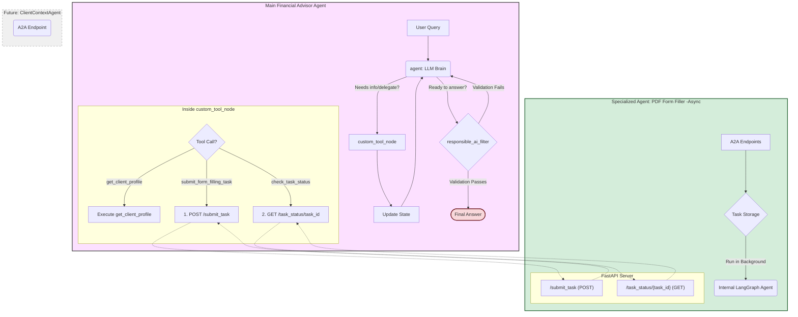

    How to Read This Diagram
Main Agent's Logic: The FinancialAdvisorAgent now contains a custom_tool_node which acts as the A2A client. It decides whether to call a simple tool like get_client_profile or to start the multi-step A2A process.

Asynchronous A2A Flow: The numbered arrows clearly show the new asynchronous pattern:

The main agent first makes a POST request to /submit_task.

It then makes one or more GET requests to /task_status to poll for the result.

PDF Agent's Role: The PDF-Form-Filler-Agent is shown as a server with distinct API endpoints. It manages tasks in a Task Storage and processes them in the background using its own internal agent.

Future Work: The ClientContextAgent is included as a grayed-out, dashed box to clearly indicate that it's the next component we plan to build and integrate.