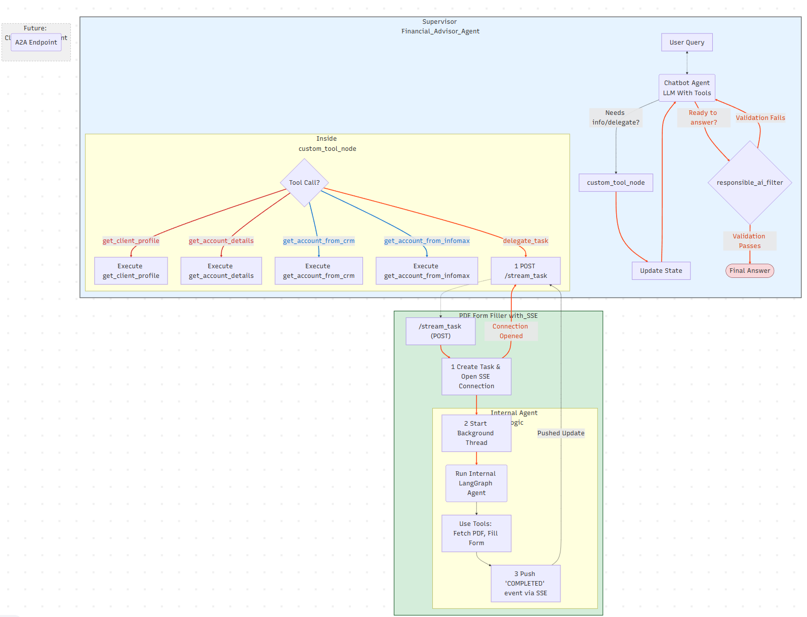

## **Event-Driven Workflow for Agent Task Delegation with Server-Sent Events (SSE)**

This document describes an event-driven workflow for task delegation, focusing on the Agent-to-Agent (A2A) protocol between a supervisor agent (FinancialAdvisorAgent) and a specialized agent (PDF-Form-Filler-Agent). The A2A protocol facilitates efficient communication and collaboration between autonomous agents in a distributed system, enabling seamless task handoffs and real-time updates.

<details>
<summary>Show Mermaid Diagram Markdown</summary>

<pre>
```mermaid
%%{init: {"themeVariables": {
  "fontSize": "24px",
  "fontFamily": "Arial, sans-serif"
}}}%%
graph TD
    subgraph FinancialAdvisorAgent [Supervisor Financial_Advisor_Agent]
        direction LR
        A[User Query] <-.-> B(Chatbot Agent<BR/> LLM With Tools);
        B -- "Needs info/delegate?" --> C[custom_tool_node];
        
        subgraph A2A_Client_Logic [Inside custom_tool_node]
            direction TB
            C1{Tool Call?}
            C1 -- "get_client_profile" --> C2[Execute get_client_profile];
            C1 -- "get_account_details" --> C2-1[Execute get_account_details];
            C1 -- "get_account_from_crm" --> C2-2[Execute get_account_from_crm];
            C1 -- "get_account_from_infomax" --> C2-3[Execute get_account_from_infomax];
            C1 -- "delegate_task" --> C3[1 POST /stream_task];
        end

        C --> D[Update State];
        D --> B;

        B -- "Ready to answer?" --> E{responsible_ai_filter};
        E -- "Validation Fails" --> B;
        E -- "Validation Passes" --> F([Final Answer]);
    end

    subgraph PDF-Form-Filler-Agent [PDF&nbsp;Form&nbsp;Filler&nbsp;with_SSE]
        G1["/stream_task (POST)"];
        
        G1 --> H1[1 Create Task & Open SSE Connection];
        H1 -- "Connection Opened" --> C3;
        H1 --> H2[2 Start Background Thread];
        
        subgraph Background_Workflow [Internal Agent Logic]
        
            H2 --> I(Run Internal LangGraph Agent);
            I --> I1[Use Tools: Fetch PDF, Fill Form];
            I1 --> I2[3 Push 'COMPLETED' event via SSE];
        end

        I2 -- "Pushed Update" --> C3;
    end
    
    subgraph ClientContextAgent_Placeholder [Future: ClientContextAgent]
        style ClientContextAgent_Placeholder fill:#f0f0f0,stroke:#999,stroke-dasharray: 5 5
        J(A2A Endpoint);
    end

    %% A2A Communication Links
    C3 -.-> G1;
    
    %% Styling
    style FinancialAdvisorAgent fill:#e6f3ff,stroke:#333,stroke-width:2px
    style PDF-Form-Filler-Agent fill:#d4edda,stroke:#155724,stroke-width:2px
    style F fill:#f8d7da,stroke:#721c24,stroke-width:2px%% Complementary link colors

linkStyle 2,3 stroke:#d32f2f,stroke-width:3px,color:#d32f2f
linkStyle 4,5 stroke:#1976d2,stroke-width:3px,color:#1976d2
linkStyle 6,7,8,9 stroke:#1a237e,stroke-width:3px,color:#1a237e
linkStyle 6,7,8,9,10,11,12,13,14,15 stroke:#ff4315,stroke-width:3px,color:#d84315


</pre>




This document outlines the communication architecture for our new multi-agent system. Our primary objective is to enable specialized agents to handle complex tasks independently, thereby preventing any performance degradation of the main Financial Advisor Agent that directly interacts with users. To achieve this, we have thoroughly evaluated several standard Agent-to-Agent (A2A) communication patterns.

### **Option 1: RESTful API with Polling**

This is a classic asynchronous pattern where the client submits a task and then periodically asks for an update.

* **Technical Flow:**  

  1. Client sends POST /submit\_task with the job payload.  
  2. Server immediately responds with 202 Accepted and a { "task\_id": "..." }.  
  3. Client then repeatedly sends GET /task\_status/{task\_id} until the status is COMPLETED or FAILED.  
* **Underlying Protocol:** Standard HTTP/1.1. Each poll is a new request/response cycle, creating and tearing down connections (unless HTTP Keep-Alive is used, which still involves new requests).

**Pros**

* **Simplicity & Reliability:** This is the easiest pattern to implement and debug. It's stateless and uses the most common web paradigm, making it universally understood.  
* **Robustness:** If a poll request fails, the client can simply try again later without disrupting the overall workflow.

**Cons**

* **High Latency:** The client only discovers that a task is complete on its next scheduled poll. If the polling interval is 5 seconds, there can be up to a 5-second delay between task completion and notification.  
* **Network Inefficiency:** The vast majority of poll requests are "wasted," as they simply return a IN\_PROGRESS status. This creates significant network chatter that doesn't scale well.

### **Option 2: WebSockets**

This pattern establishes a persistent, two-way communication channel between the agents.

* **Technical Flow:**  

  1. The client sends an initial HTTP request with an Upgrade: websocket header.  
  2. If the server agrees, the connection is upgraded from HTTP to a persistent, full-duplex TCP socket.  
  3. Both the client and server can now send JSON or binary messages to each other at any time with very low overhead.  
* **Stateful Connection:** The connection itself is stateful. Both ends need to manage the connection's lifecycle, including handling disconnects and heartbeats.

**Pros**

* **Lowest Latency:** This is the fastest possible communication method, providing true real-time, bidirectional data flow. It's the gold standard for applications that require instant interaction, such as multi-agent chat or collaborative editing.  
* **High Efficiency:** After the initial handshake, message frames are very small and efficient, with minimal overhead compared to full HTTP requests.

**Cons**

* **Implementation Complexity:** WebSockets are a different protocol from HTTP. They require more complex handling on both the client and server, including managing the connection state, handling different message types, and ensuring robust error recovery.  
* **Overkill for One-Way Notification:** For our use case, where the specialized agent only needs to send a final status update, a full two-way channel is more than we need.

### **Option 3: Server-Sent Events (SSE) \- Our Chosen Approach**

SSE provides a clean, efficient way for a server to push updates to a client over a standard HTTP connection. It perfectly fits our "fire-and-notify" model.

* **Technical Flow:**  

  1. The client makes a single HTTP request to a streaming endpoint (e.g., POST /stream\_task).  
  2. The server keeps this connection open and sends back a response with the Content-Type: text/event-stream header.  
  3. The server can now send simple, plain-text "event" messages down this open connection whenever it has an update. The client simply listens for these events.  
* **Unidirectional Flow:** It is strictly a one-way channel from the server to the client. The client cannot send messages back over the same connection.

**Pros**

* **Efficient & Real-Time:** Like WebSockets, SSE eliminates polling and provides instant notifications with low latency.  
* **Simplicity:** It's built directly on top of standard HTTP and is much simpler to implement than WebSockets. Most HTTP client libraries (like requests in Python) can handle streaming responses with minimal effort.  
* **Firewall-Friendly:** Since it's just a long-lived HTTP connection, it works seamlessly with existing network infrastructure without the configuration challenges that can sometimes affect WebSockets.  
* **Automatic Reconnection:** The SSE protocol has built-in support for clients automatically reconnecting if the connection is dropped.

**Cons**

* **One-Way Communication:** Its primary limitation is that it's unidirectional. If we ever need the main agent to have a back-and-forth "conversation" with the specialized agent, SSE would not be suitable, and we would need to upgrade to WebSockets.

For our current design, SSE hits the sweet spot, giving us the performance of a real-time, push-based system without the implementation overhead of a full bidirectional WebSocket connection.

### **This diagram shows a complete, event-driven workflow for task delegation from a supervisor agent to a specialized agent.**

1. ### **User Interaction: The process begins when a `User Query` is sent to the `FinancialAdvisorAgent`. This is handled by the `Chatbot Agent` (the LLM brain).**
1. ### **Decision Point: The Chatbot Agent analyzes the query. Based on the user's intent, it decides on one of two paths:**

   * ### **Internal Task: If it needs simple information (like a client profile, account details from CRM, etc.), it decides to call one of its internal tools.**
   * ### **External Delegation: If the task is complex and specialized (like filling a PDF), it decides to delegate the task.**
1. ### **Execution Routing: The agent's decision is passed to the `custom_tool_node`, which acts as a router.**

   * ### **If an internal tool is chosen, it executes that specific function.**
   * ### **If delegation is chosen, it initiates the A2A communication by making a `POST` request to the `/stream_task` endpoint of the `PDF-Form-Filler-Agent`.**
1. ### **Asynchronous Handoff (SSE):**

   * ### **The `PDF-Form-Filler-Agent` receives the request at its `/stream_task` endpoint.**
   * ### **It immediately creates a task record and opens a one-way SSE connection back to the `FinancialAdvisorAgent`, confirming the connection is open.**
   * ### **It then starts its own internal agent in a background thread to do the actual work.**
1. ### **Real-time Updates: As the background agent completes its work, it pushes a "COMPLETED" event through the open SSE connection. The `FinancialAdvisorAgent` receives this update instantly, without ever having to ask for it.**
1. ### **State Update & Final Answer: Once the `custom_tool_node` receives the result (either from an internal tool or the SSE event), it updates the main agent's state. The flow returns to the Chatbot Agent, which now has the information it needs to formulate a final answer, pass it through the `responsible_ai_filter`, and present it to the user.**