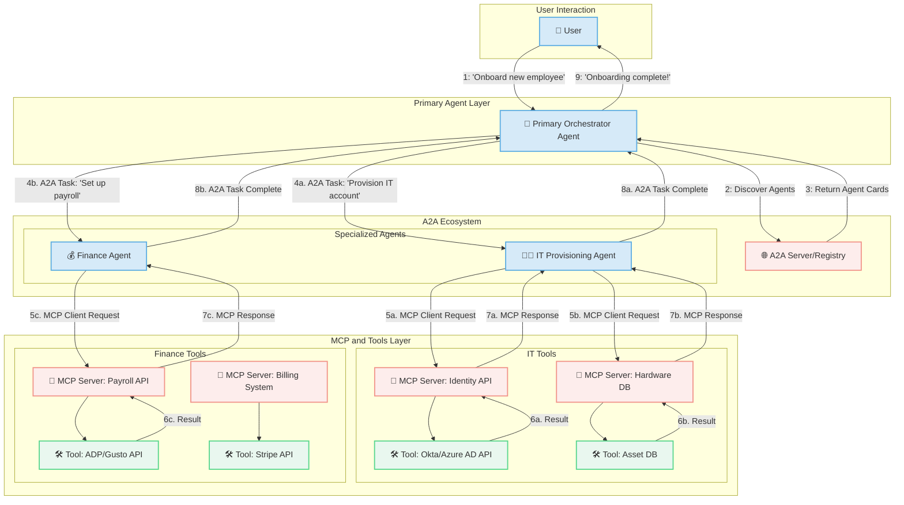

```mermaid
graph TD
    subgraph User Interaction
        User[👤 User]
    end

    subgraph Primary Agent Layer
        Orchestrator[🤖 Primary Orchestrator Agent]
    end

    subgraph A2A Ecosystem
        direction LR
        A2A_Server[🌐 A2A Server/Registry]
        subgraph Specialized Agents
            IT_Agent[👩‍💻 IT Provisioning Agent]
            Finance_Agent[💰 Finance Agent]
        end
    end

    subgraph MCP and Tools Layer
        direction LR
        subgraph IT Tools
            MCP_Server_IDM[🔌 MCP Server: Identity API] --> Tool_IDM[🛠️ Tool: Okta/Azure AD API]
            MCP_Server_Hardware[🔌 MCP Server: Hardware DB] --> Tool_Hardware[🛠️ Tool: Asset DB]
        end
        subgraph Finance Tools
            MCP_Server_Payroll[🔌 MCP Server: Payroll API] --> Tool_Payroll[🛠️ Tool: ADP/Gusto API]
            MCP_Server_Billing[🔌 MCP Server: Billing System] --> Tool_Billing[🛠️ Tool: Stripe API]
        end
    end

    %% --- Connections ---

    %% 1: User Request
    User -- "1: 'Onboard new employee'" --> Orchestrator

    %% 2: Agent Discovery via A2A
    Orchestrator -- "2: Discover Agents" --> A2A_Server
    A2A_Server -- "3: Return Agent Cards" --> Orchestrator

    %% 4: Task Delegation via A2A
    Orchestrator -- "4a. A2A Task: 'Provision IT account'" --> IT_Agent
    Orchestrator -- "4b. A2A Task: 'Set up payroll'" --> Finance_Agent

    %% 5: Agent Uses Tools via MCP
    IT_Agent -- "5a. MCP Client Request" --> MCP_Server_IDM
    IT_Agent -- "5b. MCP Client Request" --> MCP_Server_Hardware
    Finance_Agent -- "5c. MCP Client Request" --> MCP_Server_Payroll

    %% 6: Results return
    Tool_IDM -- "6a. Result" --> MCP_Server_IDM
    MCP_Server_IDM -- "7a. MCP Response" --> IT_Agent

    Tool_Hardware -- "6b. Result" --> MCP_Server_Hardware
    MCP_Server_Hardware -- "7b. MCP Response" --> IT_Agent

    Tool_Payroll -- "6c. Result" --> MCP_Server_Payroll
    MCP_Server_Payroll -- "7c. MCP Response" --> Finance_Agent

    %% 8: A2A Task Completion
    IT_Agent -- "8a. A2A Task Complete" --> Orchestrator
    Finance_Agent -- "8b. A2A Task Complete" --> Orchestrator

    %% 9: Final Response to User
    Orchestrator -- "9: 'Onboarding complete!'" --> User

    %% --- Styling ---
    classDef agent fill:#D6EAF8,stroke:#5DADE2,stroke-width:2px;
    classDef tool fill:#E9F7EF,stroke:#58D68D,stroke-width:2px;
    classDef protocol fill:#FDEDEC,stroke:#F1948A,stroke-width:2px;
    class User,Orchestrator,IT_Agent,Finance_Agent agent;
    class A2A_Server protocol;
    class MCP_Server_IDM,MCP_Server_Hardware,MCP_Server_Payroll,MCP_Server_Billing protocol;
    class Tool_IDM,Tool_Hardware,Tool_Payroll,Tool_Billing tool;

```